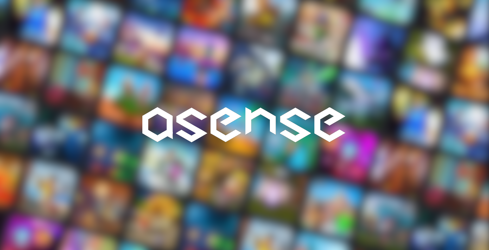
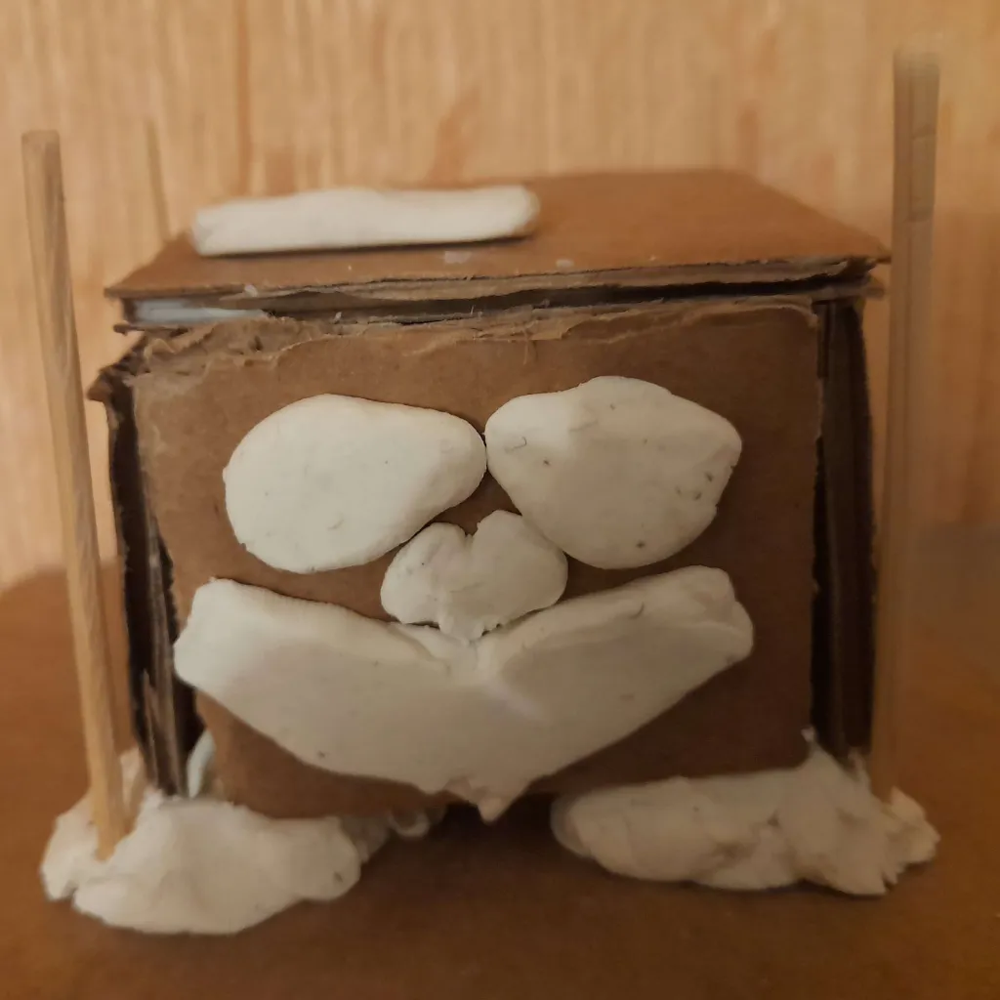
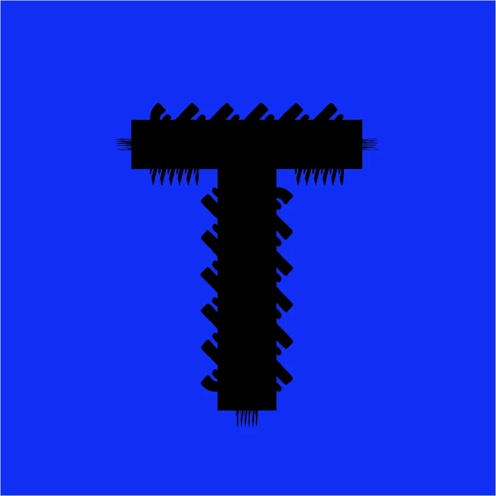

<!-- ASense - Enhancing Developer's Workflows and Experience -->

## Introduction

ASense is a dynamic and imaginative team created in 2022 with the goal of improving developers' workflows and overall experience. We take pleasure in offering cutting-edge Anti Exploit solutions, such as the ground-breaking L.A.T Anti Exploit and ASTON V3, which identify and prevent a wide range of cheats, including those involving the attachment and execution of malicious code. Our knowledge also includes spotting popular script hubs, creating a safe and secure digital environment for our customers.

## Our Slogan

For us, "safeguarding your digital experiences" is more than simply a catchphrase. It reflects the guiding philosophy that inspires us to produce world-class technologies that protect against risks and elevate the digital journey of every developer who relies on our solutions.

## Meet the Team

We feel that the devotion and competence of our team members is the key to our success. Let us present the creative brains behind ASense:

###  Liker - Founder

Liker's enthusiasm for providing seamless developer experiences has been the driving factor behind our team's success as the visionary behind ASense. Liker lays the groundwork for ASense's creative approach with an uncompromising dedication to quality. 
 

###  Jeremy - Top Board of Directors

Jeremy provides our team with essential strategic thoughts and leadership. As a key member of our Board of Directors, his knowledge guides ASense to greater success and growth.
 
 

###  IceMinister - Board of Directors

IceMinister is an important member of our Board of Directors, with an outstanding eye for detail and a plethora of expertise. Their contributions will help shape ASense's future.
 
 

###  Unlimited - Developer

Unlimited's coding prowess and innovative ideas have greatly aided in the development of our anti-exploit solutions. Their commitment to excellence guarantees that our products stay at the forefront of security.
 
 

###  TheFrenchTechMan - Developer

Because of their technical competence and problem-solving abilities, TheFrenchTechMan is an essential member of our development team. Our products reflect their dedication to developing efficient and dependable software.
 
 

## Stay Connected

Stay updated with the latest news, releases, and announcements by following us on social media:

- Twitter: [@ASenseHD](https://twitter.com/ASenseHD)
- YouTube: [@ASenseHD](https://youtube.com/@ASenseHD)
- Discord: [ASense Discord Server](https://discord.gg/JED4AcdDjQ)

Join us as we continue to innovate and enhance the developer experience while safeguarding digital experiences!
